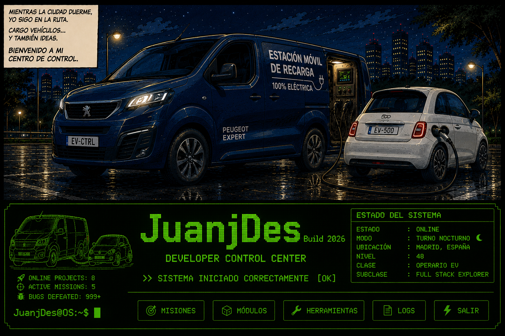

<!--
<h1 align="center">
  
  Web Developer Full Stack Junior
  
</h1>
-->

<!-- Banner Principal -->

  

<!-- Banner Retro 

  

 -->

<table align="center" style="width:100%;">
  <!--
  <tr>
    <th style="width:20%; text-align:center;">Repos</th>
    <th style="width:80%; text-align:left;">Descripción</th>
  </tr> -->

  <tr>
    <td align="center" width="80" height="80"></td>
    <td align="center">
      <h3 align="center">
        REPOSITORIOS DESTACADOS
      </h3>
    </td>
  </tr>

  <tr>
    <td align="center">
      
    </td>
    <td align="center">
      Lleva el control de vehículos eléctricos pendientes de cargar. Incluye mapa con la posición de cada vehículo
         
        <a href="https://juanjdes.github.io/RechargeEV/"> Ver Web</a>
      
    </td>
  </tr>

  
  <tr>
    <td align="center">
      
    </td>
    <td align="center">
      Precios en tiempo real de Gasolineras en España.... 
         
        <a href="https://juanjdes.github.io/Precios_Gasolineras/"> Ver Web
      </a></td>
  </tr>
  <tr>
    <td align="center">
      
    </td>
    <td align="center">Ejercicios y pruebas del OpenBootCamp</td>
  </tr>
  <tr>
    <td align="center">
      
    </td>
    <td align="center">Diferentes ejercicios en Java</td>
  </tr>
  <tr>
    <td align="center">
      
    </td>
    <td align="center">Proyecto de Dashboard con 4 elementos (Reloj, Tiempo, Password y Links).... <a href="https://juanjdes.github.io/project-break-dashboard/">Ver Web</a></td>
  </tr>
  
  <tr>
    <td align="center">
      
    </td>
    <td align="center">Pokédex básica. La Pokédex mostrará una lista de Pokémon obtenidos de la API pública de Pokémon. Los usuarios podrán navegar entre las páginas de Pokémon, buscar Pokémon específicos y ver detalles básicos.... <a href="https://juanjdes.github.io/fetch-async-await/">Ver Web</a></td>
  </tr>
  <tr>
    <td align="center">
      
    </td>
    <td align="center">Modificar lista de nombres usando useState con React.... <a href="https://juanjdes.github.io/ejercicio-useState">Ver Web</a></td>
  </tr>
  <tr>
    <td align="center">
      
    </td>
    <td align="center">Mini-Template básico para proyectos de Node + Express +ESM + Scraping</td>
  </tr>
</table>

 
<h3 align="center">
  📊 TELEMETRÍA DEL SISTEMA
</h3>

  
  

 

  

