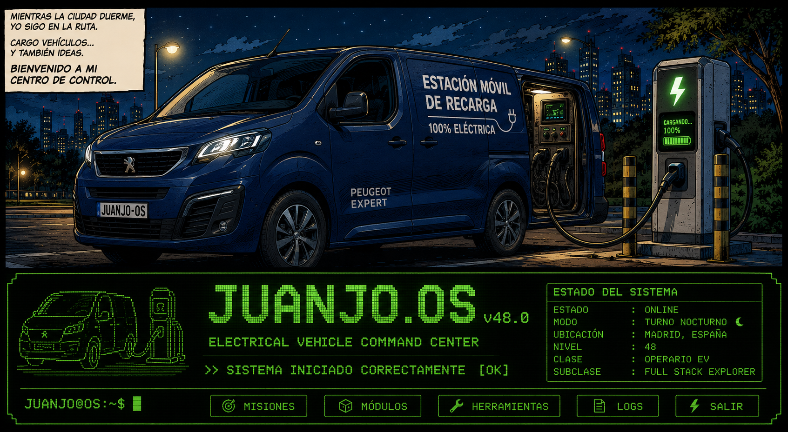

<!--
<h1 align="center">
  
  Web Developer Full Stack Junior
  
</h1>
-->

<!-- Banner Principal -->

  

<!-- Banner Retro -->

  

<h4 align="center">
  REPOSITORIOS DESTACADOS
</h4>

<table align="center" style="width:100%;">
  <tr>
    <th style="width:20%; text-align:center;">Repos</th>
    <th style="width:80%; text-align:left;">Descripción</th>
  </tr>
  <tr>
    <td align="center">
      
    </td>
    <td>Precios en tiempo real de Gasolineras en España.... <a href="https://juanjdes.github.io/Precios_Gasolineras/"> Ver Web</a></td>
  </tr>
  <tr>
    <td align="center">
      
    </td>
    <td>Ejercicios y pruebas del OpenBootCamp</td>
  </tr>
  <tr>
    <td align="center">
      
    </td>
    <td>Diferentes ejercicios en Java</td>
  </tr>
  <tr>
    <td align="center">
      
    </td>
    <td>Proyecto de Dashboard con 4 elementos (Reloj, Tiempo, Password y Links).... <a href="https://juanjdes.github.io/project-break-dashboard/">Ver Web</a></td>
  </tr>
  <tr>
    <td align="center">
      
    </td>
    <td>API de REST Countries para obtener información sobre países y mostrarla en una interfaz de usuario.... 
      <!--<a href="https://juanjdes.github.io/diversion-con-banderas/">Ver Web</a><!--></td>
  </tr>
  <tr>
    <td align="center">
      
    </td>
    <td>Pokédex básica. La Pokédex mostrará una lista de Pokémon obtenidos de la API pública de Pokémon. Los usuarios podrán navegar entre las páginas de Pokémon, buscar Pokémon específicos y ver detalles básicos.... <a href="https://juanjdes.github.io/fetch-async-await/">Ver Web</a></td>
  </tr>
  <tr>
    <td align="center">
      
    </td>
    <td>Modificar lista de nombres usando useState con React.... <a href="https://juanjdes.github.io/ejercicio-useState">Ver Web</a></td>
  </tr>
  <tr>
    <td align="center">
      
    </td>
    <td>Mini-Template básico para proyectos de Node + Express +ESM + Scraping</td>
  </tr>
</table>

  

